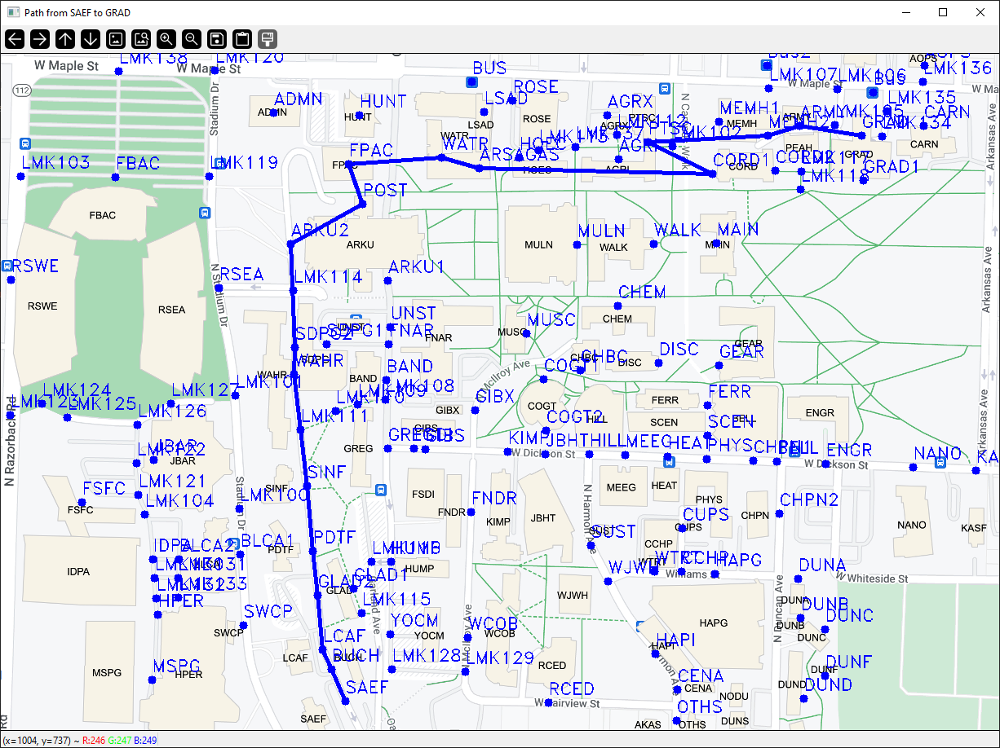

# maps
This was a university project where I made a map of the university campus with the ability to find a route from one location to another.



# Install

## Install GCC/G++

### Linux
Install GCC/G++ with
```bash
sudo apt install gcc g++
```

### MacOS
Install brew with
```bash
/bin/bash -c "$(curl -fsSL https://raw.githubusercontent.com/Homebrew/install/HEAD/install.sh)"
```
Install GCC/G++ with
```bash
brew install gcc
```

### Windows
Download and install MSYS2 from the MSYS2 website

Install MinGW with
```bash
pacman -S mingw-w64-x86_64-toolchain
```
or just these packages
```bash
pacman -S mingw-w64-x86_64-gcc
pacman -S mingw-w64-x86_64-make
```

Add the binaries folder to the environment variables

## Install Make

### Linux
Install Make with
```bash
sudo apt install make
```

### MacOS
Install Make with
```bash
brew install make
```

### Windows
It should have already been installed with GCC/G++ in the 'Install GCC/G++' section

## Install OpenCV

### Linux
Install OpenCV with
```bash
sudo apt install libopencv-dev
```

Install pkg-config with
```bash
sudo apt install pkg-config
```

### MacOS
Install OpenCV with
```bash
brew install opencv
```
Install pkg-config with
```bash
brew install pkg-config
```

### Windows
#### OpenCV from source
Download, install, and build OpenCV 3.4.13 from the OpenCV website

Copy and paste the following files from
```
C:\opencv-3.4.13\build\bin
```
to the project folder:
- libopencv_core3413.dll
- libopencv_highgui3413.dll
- libopencv_imgcodecs3413.dll
- libopencv_imgproc3413.dll

#### Or just use MSYS2
The Qt version may vary
```bash
pacman -S mingw-w64-x86_64-opencv
pacman -S mingw-w64-x86_64-qt6-base
```

# Build
Edit the appropriate makefile for your system
1. remove the file extension
2. add the appropriate paths for 'CC=' and 'CXX=' for your system if it is not already the case
3. set 'OPENCV=1' for compiling with OpenCV or 'OPENCV=0' to not compile with OpenCV

To run compile and run Prim's algorithm, run this command:
```bash
make prim
```

To run compile and run Kruskal's algorithm, run this command:
```bash
make kruskal
```

To run compile and run Dijkstra's algorithm, run this command:
```bash
make dijkstra
```

To find a route between different buildings for Dijkstra's algorithm, edit the 'main.cpp' file and change the parameters of the line
```c++
searchOnCampus("SAEF", "GRAD");
```
to the names of your desired buildings.
